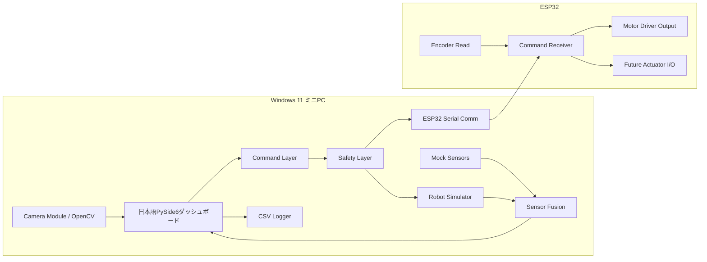

# アーキテクチャ

このプロジェクトでは、PCを高レベル制御の中心、ESP32を低レベルI/Oコントローラとして扱います。

## PC側の責務

- 日本語UI表示
- センサ値の取得とMockデータ生成
- 自己位置推定と仮想フィールド表示
- コマンド生成と安全確認
- シミュレーションモードでの仮想ロボット更新
- ESP32への走行指令送信
- 安全状態表示と緊急停止指令
- CSVログ保存

## ESP32側の責務

- PCからの指令受信
- モータドライバ出力
- エンコーダ読み取り
- 将来のアーム、ツール、センサ用I/O
- フェイルセーフ停止

## コマンドレイヤー

`pc/control/` にPC中心のコマンド処理を置いています。

- `robot_command.py`: 指令の解析と整形
- `safety_layer.py`: 速度制限、緊急停止、不正指令の安全化
- `command_sender.py`: Mock送信またはSerial送信
- `command_history.py`: 最近の指令履歴

詳しくは `docs/command_and_safety.md` を参照してください。

## シミュレーション

`pc/simulation/` に仮想フィールドと簡易差動二輪シミュレータを置いています。
Simulationモードでは、UIの走行指令がSafety Layerを通ったあと、仮想ロボットの位置、エンコーダ、オドメトリ値にも反映されます。

詳しくは `docs/simulation.md` を参照してください。
